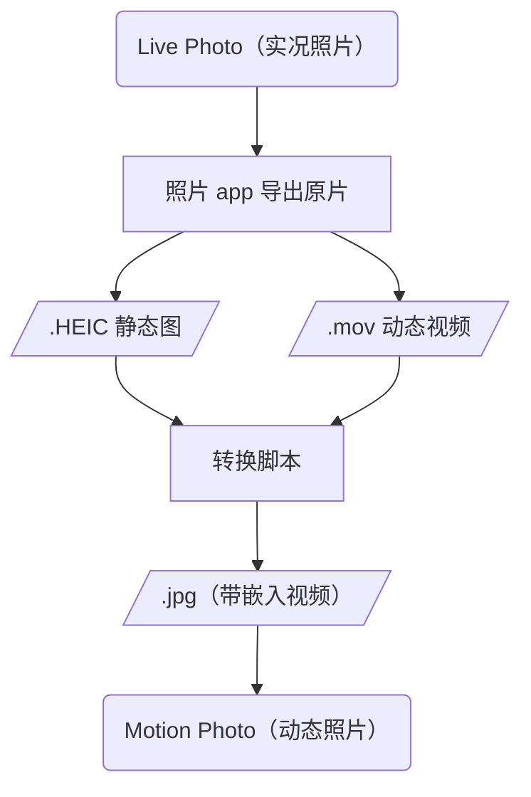
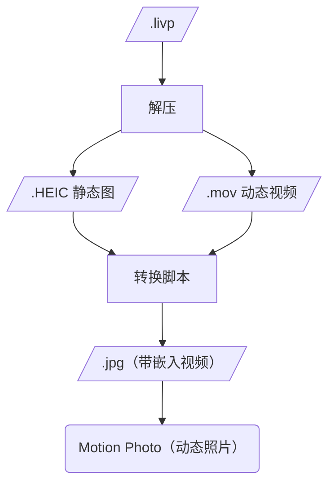
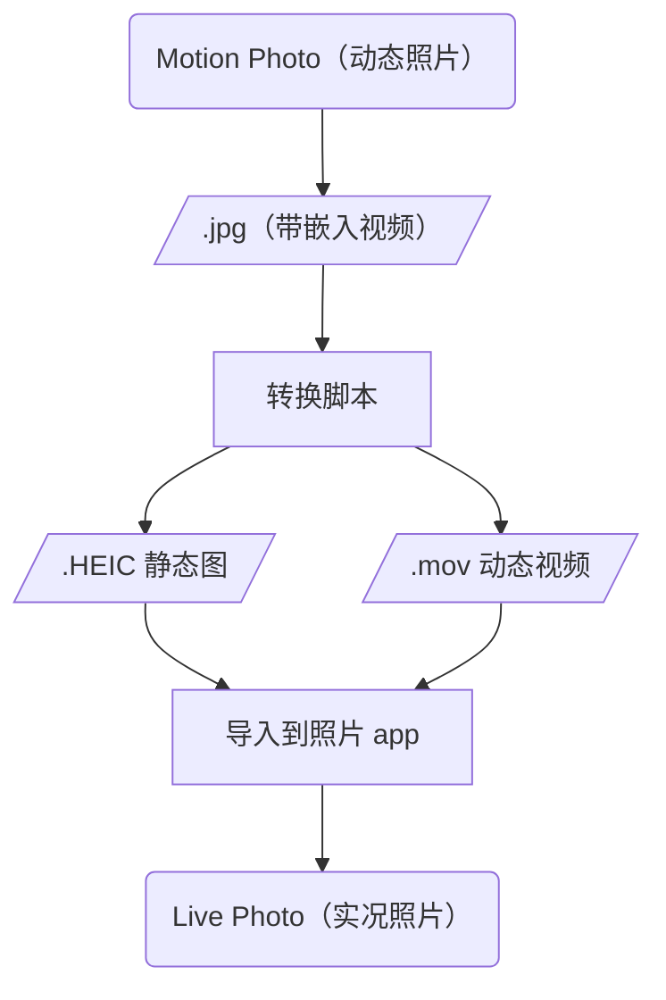

# Live motion photos convert

实现 Apple Live Photo （实况照片） 和 Android Motion Photo （动态照片）的双向转换，且保持动态视频可播放。

本项目是在本人 Apple 和 小米 双持的背景下，为解决两边实况图互转而产生的。其实可以借用百度网盘、抖音、小红书、微信实现实况图跨设备互转。但是要么下载太慢，要么有损失，最重要的是无法批量。Github 上没找到完全满足需求的工具，故自己写了一个，想实现批量互转。(注意：Vibe Coding 项目，无人工代码评审)

仅在以下环境测通：
    - macOS 照片 app（生成图片和视频导入后可识别为实况图并正常播放）
    - 小米 HyperOS 3（apple 实况图转 jpg 后能在相册中识别为动态图并播放）
    - HyperOS下的微信（apple 实况图转 jpg 后能在微信中识别为实况）

## 文件格式原理简介

**Apple Live Photo 格式：**

- HEIC/mov：Apple 照片库中的实况图片实际上是一对文件，包含静态图片(HEIC)和动态视频(mov)，从照片 app 导出选项选未修改原片可导出这两个文件。
- livp：大部分网盘(实测百度网盘) 的格式，实际上是 zip 格式，里面包含 HEIC 和 mov 文件。另测试阿里云盘仅 IOS 端可导出完整实况照片，其它平台均导出为 HEIC 静态图，无法导出视频。

**Android Motion Photo 格式：**

- jpg： 谷歌标准的动态图原理是在静态 jpg 文件后面插入了一个 mp4 视频文件，通过 XMP 标签记录视频文件的具体信息。但国产手机可能有自己的特殊标准或特殊标签。导致不兼容，无法播放实况。我只测试了小米手机和小米版微信。

## 流程图

## 参数说明

- `--input/-i <输入文件路径>`: 输入 .livp / .HEIC 则转 jpg；输入 .jpg 则转 HEIC + mov。
- `--output/-o <输出文件路径>`: 不指定则与输入同名同目录。
- `--log/-l`: 是否输出日志

## Mac 下安装和运行

    # clone repo
    cd live_motion_photos_convert
    brew install ffmpeg exiftool imagemagick

运行：

    # 动态 jpg 转 HEIC+mov (-o 指定 HEIC 路径即可， mov 会自动在同目录生成):
    python3 main.py -i input.jpg -o output.HEIC

    # HEIC+mov 转 动态 jpg (确保同目录下同名 .mov 文件存在):
    python3 main.py -i input.HEIC -o output.jpg

    # livp 转 jpg:
    python3 main.py -i input.livp -o output.jpg

## 批量处理

**示例：**

    # 将某目录下所有 .livp 转为 JPG，输出到该目录下的 jpg 子目录
    python3 batch.py -t livp -i /path/to/photos

    # 将某目录下所有 .heic+.mov 转为 JPG，输出到指定目录
    python3 batch.py -t heic -i /path/to/live_photos -o /path/to/output_jpg

    # 将某目录下所有 Motion Photo JPG 转为 HEIC+MOV，输出到该目录下的 heic 子目录
    python3 batch.py -t jpg -i /path/to/motion_jpgs

**参数：**

- `--type` / `-t`：转换类型（必填），取值：
  - `livp`：livp → jpg（目录内 .livp 转为 Motion Photo JPG）
  - `heic`：heic → jpg（目录内 .heic + 同名 .mov 转为 Motion Photo JPG）
  - `jpg`：jpg → heic（目录内 Motion Photo .jpg/.jpeg 转为 HEIC + MOV）
- `--input` / `-i`：输入目录（必填）
- `--output` / `-o`：输出目录（可选）。不指定时，在输入目录下自动创建子目录，目录名为**转换后的格式**：livp/heic 转出为 jpg 时用 `jpg`，jpg 转出为 heic 时用 `heic`

## MakerNotes 处理逻辑说明

在 **JPG（Motion Photo）→ HEIC + MOV** 时，要让 iOS 相册把生成的 HEIC 和 MOV 识别为同一张「实况照片」，需要满足 Apple 的配对规则：**HEIC 与 MOV 里各有一份相同的 Content Identifier（UUID）**。系统通过比对这两处的 UUID 将静态图与短视频关联成一对。

- **MOV 侧**：通过 exiftool 写入 QuickTime `[Keys] Content Identifier` 即可，exiftool 支持直接写入。
- **HEIC 侧**：Content Identifier 在 Apple 设备导出的 HEIC 里存放在 **MakerNotes** 块中（`[MakerNotes] Content Identifier`）。而用 ImageMagick（magick）从 JPG 转出的 HEIC **没有** Apple 的 MakerNotes 结构，exiftool 无法在「空」的 HEIC 上单独创建或写入 MakerNotes 里的某一项，会得到 "image files unchanged"。

MakerNotes 是 Apple 的私有标准没查到资料，因此这里借用了微信的实况图，其图的 MakerNotes 相对干净，从中提取了 MakerNotes 保存下来复用。

## 核心工具库

ffmpeg、exiftool、imagemagick

## 参考项目

- [live-photo-conv](https://github.com/wszqkzqk/live-photo-conv)
- [makelive](https://github.com/RhetTbull/makelive)
- [AppleLIVP_to_XiaomiMotionPhoto](https://github.com/lft123454321/AppleLIVP_to_XiaomiMotionPhoto)

## License

This project is licensed under the MIT License.