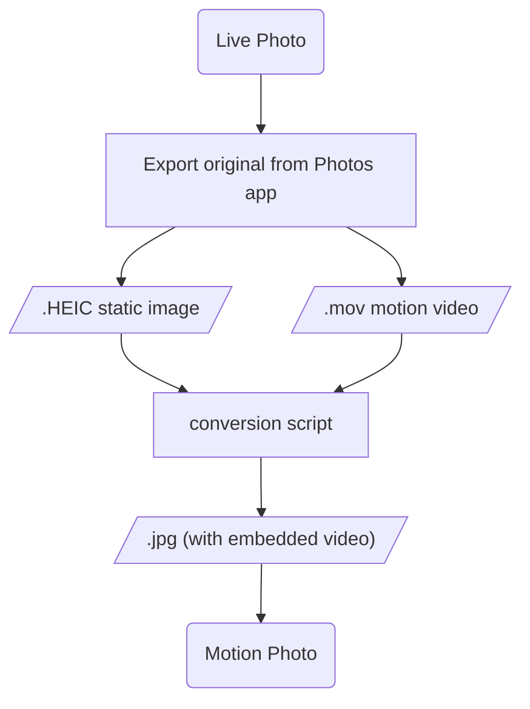
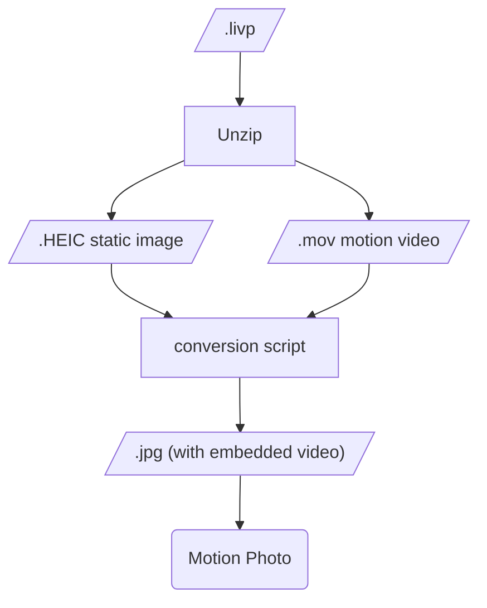
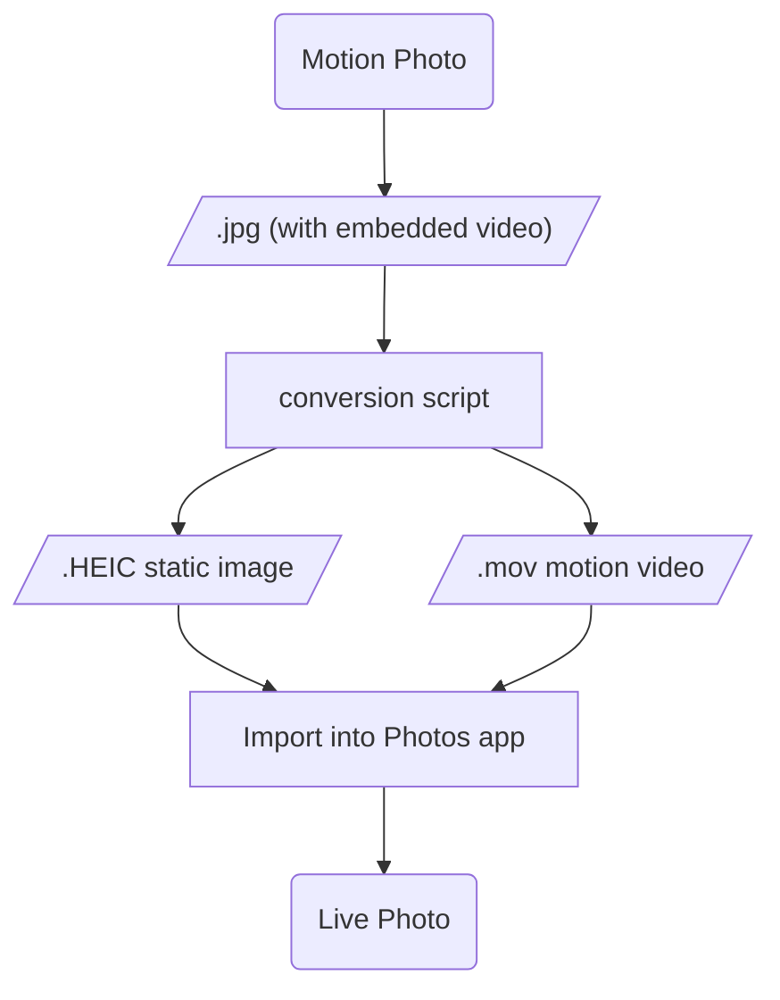

# Live motion photos convert

Bidirectional conversion between Apple Live Photo and Android Motion Photo, while keeping motion video playable.

## Background

This project comes from my own Apple + Xiaomi dual-device use case. Cross-platform Live Photo conversion can be done through Baidu Netdisk, Douyin, Xiaohongshu, WeChat, etc., but they are often slow, lossy, and most importantly not batch-friendly. I couldn't find an existing tool on GitHub that fully matched this need, so I built one for batch conversion. (Note: Vibe Coding project, without manual code review.)

Tested only in the following environments:

- macOS Photos app (generated image + video can be recognized as Live Photo and play normally)
- Xiaomi HyperOS 3 (Apple Live Photo -> JPG can be recognized and played as Motion Photo in Gallery)
- WeChat on HyperOS (Apple Live Photo -> JPG can be recognized as Live Photo in WeChat)

## File Format Basics

**Apple Live Photo format:**

- HEIC/MOV: in Apple Photos, a Live Photo is actually a pair of files: static image (HEIC) and motion video (MOV). Export "Unmodified Original" from Photos to get both files.
- LIVP: used by many cloud drives (Baidu Netdisk tested), essentially a ZIP containing HEIC and MOV. In testing, Aliyun Drive exports full Live Photo only on iOS; other platforms export static HEIC only.

**Android Motion Photo format:**

- JPG: under Google's standard approach, an MP4 video is appended to the end of a static JPG, and XMP tags record video info. Some Chinese OEMs may use custom variants/tags, which can cause incompatibility. Current testing is mainly on Xiaomi phone and Xiaomi WeChat.

## Install and Run on macOS

```bash
# clone repo
cd live_motion_photos_convert
brew install ffmpeg exiftool imagemagick libheif libultrahdr
```

Run:

```bash
# Motion JPG -> HEIC+MOV (-o only needs HEIC path; MOV is auto-generated in same directory)
python3 main.py -i input.jpg -o output.HEIC

# HEIC+MOV -> Motion JPG (make sure same-name .mov exists in same directory)
python3 main.py -i input.HEIC -o output.jpg

# LIVP -> JPG
python3 main.py -i input.livp -o output.jpg
```

**Arguments:**

- `--input/-i <input path>`: input `.livp` / `.HEIC` converts to JPG; input `.jpg` converts to HEIC + MOV.
- `--output/-o <output path>`: if omitted, output uses input name in the same directory.
- `--log/-l`: enable logging.

## Batch Processing

**Examples:**

```bash
# Convert all .livp in a directory to JPG, output to ./jpg subdirectory
python3 batch.py -t livp -i /path/to/photos

# Convert all .heic+.mov pairs in a directory to JPG, output to specific directory
python3 batch.py -t heic -i /path/to/live_photos -o /path/to/output_jpg

# Convert all Motion Photo JPG files in a directory to HEIC+MOV, output to ./heic subdirectory
python3 batch.py -t jpg -i /path/to/motion_jpgs
```

**Arguments:**

- `--type` / `-t`: conversion type (required), values:
- `livp`: livp -> jpg (all `.livp` in directory to Motion Photo JPG)
- `heic`: heic -> jpg (all `.heic` + same-name `.mov` pairs to Motion Photo JPG)
- `jpg`: jpg -> heic (all Motion Photo `.jpg/.jpeg` to HEIC + MOV)
- `--input` / `-i`: input directory (required)
- `--output` / `-o`: output directory (optional). If omitted, a subdirectory is auto-created under input directory, named by target format: `jpg` for livp/heic -> jpg, `heic` for jpg -> heic.

## Workflow Diagrams







## MakerNotes Handling Logic

For **JPG (Motion Photo) -> HEIC + MOV**, to make iOS Photos recognize generated HEIC + MOV as one Live Photo, Apple pairing rules must be met: **the same Content Identifier (UUID) must exist in both HEIC and MOV**. iOS associates static image and short video by matching this UUID.

- **MOV side**: write QuickTime `[Keys] Content Identifier` using exiftool (directly supported).
- **HEIC side**: in Apple-exported HEIC, Content Identifier is stored in **MakerNotes** (`[MakerNotes] Content Identifier`). A HEIC converted from JPG by ImageMagick usually has no Apple MakerNotes structure, and exiftool cannot create/write a single MakerNotes entry on an "empty" HEIC (you may get "image files unchanged").

MakerNotes is Apple-private and not well documented publicly. This project reuses a relatively clean MakerNotes block extracted from a WeChat Live Photo sample.

## Cover Frame Notes

- macOS: for JPG (Motion Photo) -> HEIC+MOV, AVFoundation is preferred to write Apple `still-image-time` timed metadata. After import into Photos, cover frame can be recognized in Edit.
- non-macOS or AVFoundation unavailable: automatically falls back to ffmpeg path; pairing and playback usually still work, but editable cover frame is not guaranteed.

## Core Tooling

ffmpeg, exiftool, imagemagick, libheif, libultrahdr, AVFoundation

## Reference Projects

- [live-photo-conv](https://github.com/wszqkzqk/live-photo-conv)
- [makelive](https://github.com/RhetTbull/makelive)
- [AppleLIVP_to_XiaomiMotionPhoto](https://github.com/lft123454321/AppleLIVP_to_XiaomiMotionPhoto)

## License

This project is licensed under the MIT License.
